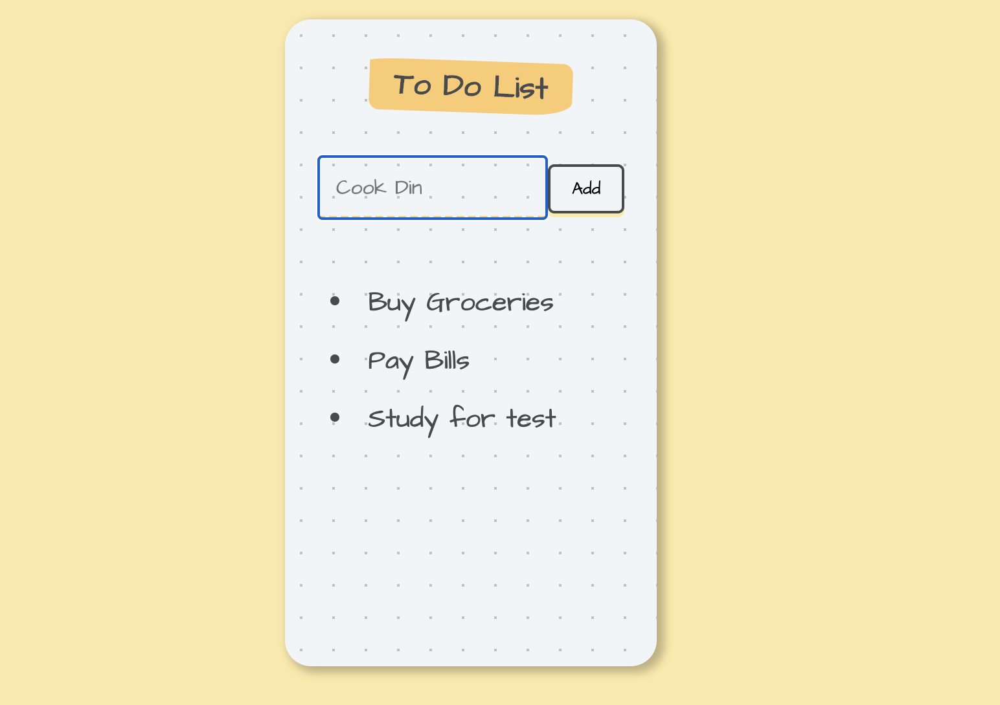

# To-Do-List

## Description

This is a to-do-list web web application built with REACT.

## Table of Contents

* [Description](#description)
* [Technology](#technology)
* [User Story](#user-story)
* [Installation](#installation)
* [Usage](#usage)
* [License](#license)
* [Contributing](#contributing)
* [Tests](#tests)
* [Questions](#questions)
* [Deployed Application URL](#deployed-application-URL)

## Technology
- REACT
- REACT Hooks
- HTML
- CSS 
- JavaScript

## User Story

As a busy programmer, I want a to-do-list application to keep track of my daily chores.

## Installation

No installation needed. 

## Usage

The deployed application link will take you to the homepage. From the homepage, you can type in your to do list item in the input field. Click on add to add the item to your list. Click on any to-do-list item to delete it from the list.

## License

## Contributing

Please follow standard contributing guidelines.

## Tests

No tests to run.

## Questions

For any questions, please contact kendayao at kendayao@gmail.com

## Deployed Application URL

Deployed application link: https://kendayao.github.io/To-Do-List/

